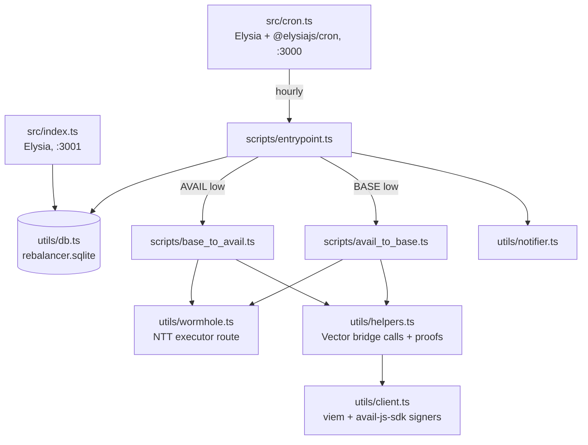

# CLAUDE.md

This file provides guidance to Claude Code (claude.ai/code) when working with code in this repository.

## What this is

A Bun/TypeScript service that keeps an AVAIL token pool balanced between the Avail chain and Base. Every hour it reads pool balances and, if either side is below `THRESHOLD`, bridges `AMOUNT_TO_BRIDGE` from the richer side. There is no direct Avail↔Base bridge: every rebalance is a two-leg trip through Ethereum.

## Commands

```bash
bun install
bun run start-cron        # cron server, port 3000 (hourly job + stop/pause/resume/trigger-run)
bun run start             # core API server, port 3001 (/status, /history, /legacy/wormhole-initiate)
docker compose up         # runs both servers, shares ./data volume

bun run scripts/test.ts   # ad-hoc scratch runner; gitignored, edit main() to exercise one leg
bun run legacy/eth_claim.ts     # manual claim on Ethereum/Base (needs BLOCK_NUMBER, TX_INDEX, FINALIZED_BLOCK)
bun run legacy/avail_claim.ts   # manual claim on Avail (needs MESSAGE_ID, AVAIL_CLAIM_AMOUNT, SURI)
```

There is no test suite, linter, or build step. Bun runs the TS directly. `tsconfig.json` only `include`s `scripts/**`, so `tsc` does not type-check `src/` or `utils/`.

Copy `.env.example` to `.env`. The example is pre-filled for Turing testnet (`CONFIG=Testnet`). `validateEnvVars()` in `utils/helpers.ts` is the authoritative list of required vars and exits the process if any are missing.

## Architecture



**Two servers, one SQLite file.** `src/cron.ts` and `src/index.ts` are separate Bun processes that both open `rebalancer.sqlite` from the working directory. The `job_status` table is the only shared state and doubles as a run-lock: a row with `status='running'` means a job is in flight.

**Both API servers gate every route on Unkey.** The `x-api-key` header is verified via `UNKEY_ROOT_KEY` in an `onBeforeHandle` hook. That includes the `/` health checks, so the docker-compose healthcheck (plain curl, no key) will fail unless that is changed.

### The two bridging legs

| Direction | Leg 1 | Leg 2 | Typical wall time |
|-----------|-------|-------|-------------------|
| Avail → Base (`AVAIL_TO_BASE`) | Vector: `vector.sendMessage` extrinsic on Avail, wait for finality, poll `/v1/avl/head` until committed, fetch merkle proof, call `receiveAVAIL` on Ethereum (up to 30 tries, 10 min apart) | Wormhole NTT Ethereum → Base via executor route | hours |
| Base → Avail (`BASE_TO_AVAIL`) | Wormhole NTT Base → Ethereum, then verify ERC20 arrived in `EVM_POOL_ADDRESS` | Vector: `sendAVAIL` on the Ethereum bridge proxy, poll `/v1/eth/head` until the tx block is covered, fetch account/storage proofs, `vector.execute` extrinsic on Avail (3 hour cap) | hours |

Key constants: Vector domain IDs are `1` = Avail, `2` = Ethereum. `ASSET_ID` is the zero bytes32 (native AVAIL). EVM addresses sent to Avail are right-padded to 32 bytes with `padEnd(66, "0")`; Substrate addresses sent to Ethereum go through `substrateAddressToPublicKey`.

**Bridge API** (`BRIDGE_API_URL`) serves the `/v1/` endpoints: `avl/head`, `eth/head`, `eth/proof/{blockhash}?index=`, `avl/proof/{blockhash}/{messageId}`. Responses are parsed with `json-bigint` because amounts overflow `Number`.

### Wormhole layer (`utils/wormhole.ts`)

`initiateWormholeBridge(client, srcChain, dstChain, amount?, track=true)` uses the NTT executor route (`nttExecutorRoute`). Chain names come from `BASE_NETWORK`/`ETH_NETWORK` (`Base`/`BaseSepolia`, `Ethereum`/`Sepolia`) and must match what the Wormhole SDK expects. Token, manager, and transceiver addresses are built into `UPDATED_NTT_TOKENS` from env at import time, so importing this module with missing env throws. When `track` is true it polls the executor status API until the relay is `submitted`. The comment in the file is accurate: if this breaks in prod, check the `overrides` block in `package.json` first, since the NTT packages pin an older `@wormhole-foundation/sdk`.

### Signers (`utils/client.ts`)

Module-level singletons, created at import: `publicClient`/`walletClient` for Ethereum, `baseClient` for Base (read-only; Base writes go through the Wormhole SDK signer), `availAccount` sr25519 keyring from `AVAIL_POOL_SEED`. `CONFIG=Mainnet` selects mainnet chains, anything else selects Sepolia/BaseSepolia. `EVM_POOL_SEED` falls back to `WALLET_SIGNER_KEY_ETH` for compatibility with the legacy scripts.

### Retry conventions

Chain writes are wrapped in a 3-attempt loop with `1000 * 2 ** i` backoff. Long polls sleep 60 s between head checks. Ethereum receipts wait for 5 confirmations. Keep new chain interactions on the same pattern.

### Notifications

`sendNotificationChannel` posts Slack Block Kit messages to a hardcoded channel ID in `utils/notifier.ts`. The `details` string is parsed line by line: `*Key:* value` becomes a field, `*Key:*` alone starts a section, `- item` lines append to it. Success on "balances sufficient" is deliberately silent to avoid hourly noise.

## Deployment

Runs on Kubernetes via Porto as `bridge/mainnet/liquidity-bridge-rebalancer`. `deploy/porto.toml` is the config, `deploy/Dockerfile` + `deploy/entrypoint.sh` run both servers in one container, and `deploy/README.md` has the setup and deploy commands. No ingress: the API and cron servers are reachable in-cluster only. Secrets come from AWS SSM under `/porto/mainnet/liquidity-bridge-rebalancer/`. The SQLite file lives on a 1Gi PVC at `/app/data` via `DB_PATH`; `utils/db.ts` falls back to `rebalancer.sqlite` in the working directory when `DB_PATH` is unset (the compose `./data` volume never held the DB for that reason).

## Directory notes

- `scripts/` holds the job logic despite the name. `src/` is only the two HTTP servers.
- `legacy/` are standalone one-shot claim scripts with their own env var set (see bottom of `.env.example`) and a hardcoded mainnet Avail RPC. They are documented in the README for manual recovery.
- `multisig/` are Safe-based variants of the Avail → Base flow for pools held in a Gnosis Safe; not wired into the servers.
- `utils/abi.ts` is the full Vector bridge proxy ABI plus a minimal `balanceOf` ABI and the `MessageSent` event used to extract `messageId` from receipts.
